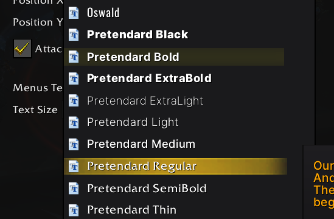

# SharedMedia_Pretendard

- Add the Pretendard fonts to `libsharedmedia`-compatible addons.

## Pretendard?

<picture>
  <source media="(prefers-color-scheme: dark)" srcset="https://github.com/orioncactus/pretendard/blob/HEAD/docs/images/thumbnail/dark/thumbnail.svg">
  
</picture>

- Pretendard is a modern, cross-platform system-ui alternative font based on Inter, Source Han Sans, and M PLUS 1p.
- Supports Korean (KR) and Western languages.

## Download Links

- [Pretendard repo](https://github.com/orioncactus/pretendard)
